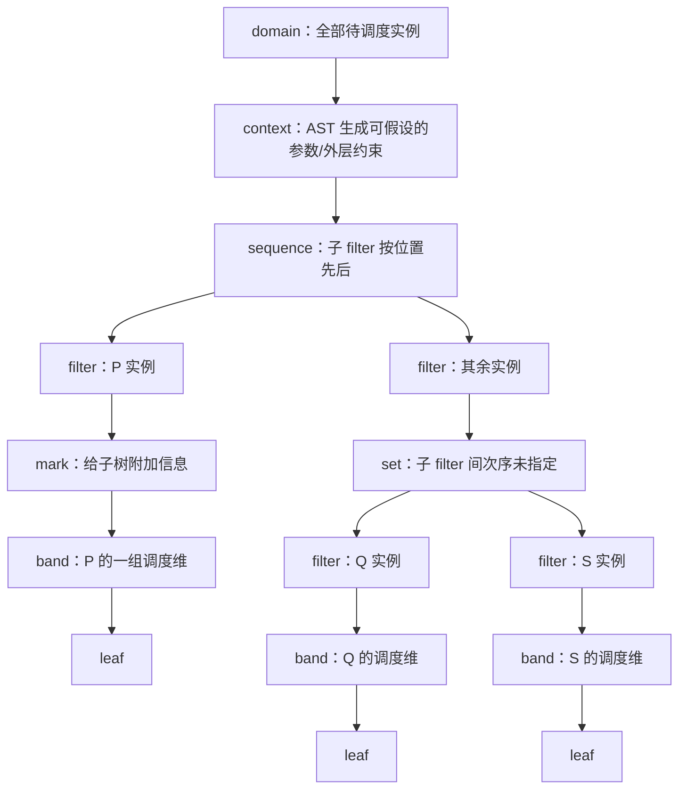

# 第 10 章：调度变换与调度树

## 直觉

第 8–9 章得到的不是一段新的循环文本，而是一个满足依赖约束的执行顺序。本章把常见循环变换统一看成“替换调度”：实例域和语句语义先保持不变，只把原调度 \(\Theta\) 换成候选调度 \(\Theta'\)，然后重新检查每条 source → sink 依赖是否仍严格向前。

这种视角把两个经常混淆的问题拆开：

1. **语义合法性**：变换后的依赖像是否都落在严格词典序的正向区域；
2. **性能取舍**：合法候选是否改善局部性、并行粒度或向量化，又是否增加边界控制、同步、寄存器压力或代码体积。

Fusion、fission、interchange、skewing、wavefront、strip-mining 和 tiling 都不天然合法，也不天然更快。合法性必须针对完整依赖关系证明；性能只能结合目标机器和代价模型判断。

单个 schedule map 很适合陈述“每个实例映到什么时间戳”，但真实优化还要表达语句分支、顺序或无序组合、band、tiling 层次和附加标记。为此，本章还区分 schedule map 与结构化 schedule tree。后者是编译器表示，不是 Presburger 算术新增的逻辑运算。

## 形式定义

### 变换后的依赖像与统一合法性判据

对语句 \(S\) 的实例 \(x\in D_S(p)\)，令候选新调度为

\[
\Theta'_S:D_S(p)\to\mathbb Z^k.
\]

对依赖 \(\Delta_{S\to T}\subseteq D_S\times D_T\)，其调度像定义为

\[
\Delta_{\Theta'}=
\{(\Theta'_S(x),\Theta'_T(y))\mid(x,y)\in\Delta_{S\to T}\}.
\]

按照全文固定的关系复合方向，也可写成

\[
\Delta_{\Theta'}
=\Theta'_T\circ\Delta_{S\to T}\circ(\Theta'_S)^{-1}.
\]

这里把调度视为关系，所以 \(\Theta'\) 即使不是单射，复合仍有定义。令词典序坏集为

\[
B_{\mathrm{lex}}
=\{(u,v)\mid\neg(u\mathrel{\mathrm{lex}<}v)\}.
\]

候选调度合法当且仅当对所有依赖分支都有

\[
\boxed{\Delta_{\Theta'}\cap B_{\mathrm{lex}}=\varnothing.}
\]

等价地，\(\Theta'_T(y)-\Theta'_S(x)\) 的第一个非零分量必须为正。若必须保序的两端被映到同一时间戳，差为零，不满足本教程的严格合法性契约；不能把“代码生成器也许碰巧排对”当作证明。

### Schedule map 与 schedule tree 不是同一个对象

**Schedule map** 是从带语句标识的实例域到共同 schedule space 的映射或关系，例如

\[
\{P(i)\mapsto(i,0),\ Q(i)\mapsto(i,1)\}.
\]

它直接表达由时间戳词典序诱导的先后，适合计算依赖像。一个扁平 map 可以编码复杂顺序，却不自然保留“这两条语句是 sequence 的两个分支”“这两维组成可置换 band”或“外层是 tile、内层是 tile 内点”这类结构意图。

**Schedule tree** 则把这些结构显式分层。下面的图使用 isl 的节点术语；它说明一种合法的结构关系，不表示所有调度树都必须包含这些节点。



图中节点的作用必须逐项区分：

- `domain` 描述整棵树适用的域元素，通常位于根；它不是参数上下文。
- `context` 是 AST 生成器支持的 schedule-tree 节点，给出可假设成立的参数和外层 band 约束；它不等同于根 `domain`，也不保证最终一定生成运行时 guard。
- `filter` 只把当前子树限制到一个实例子集，本身不施加次序，也不是 AST 的 `if` 节点。
- `sequence` 的孩子是构成当前域分割的 filters，不同孩子按树中位置排序。
- `set` 的孩子同样是 filters，但孩子之间允许任意次序；“未指定次序”不等于已经证明可并行。
- `band` 保存一组调度维及其属性。一个 band、一个调度维和一层最终 AST `for` 之间都没有机械一一对应关系。
- `mark` 给子树附加任意信息；它不会自动完成优化或并行化。
- `leaf` 不再增加次序，也不必只对应一个源码语句。

这些是 [isl 0.28 官方手册](https://libisl.sourceforge.io/manual.pdf)中 schedule tree 的工具表示语义（访问日期：2026-07-22），不是 Presburger 算术自身的语法节点。树比单个矩阵或扁平 map 更适合表达分支、融合结构、band 属性与 tiling 层次；若用 `isl_schedule_get_map` 扁平化，得到的是编码相对次序的 schedule map，不应反过来声称树与 map 是同一个对象。

## 手算示例

### Fusion 与 fission：逐元素生产者—消费者

考虑两个分离循环：

```c
for (int i = 0; i < N; ++i)
  P: tmp[i] = f(in[i]);
for (int i = 0; i < N; ++i)
  Q: out[i] = g(tmp[i]);
```

假设数组不发生额外别名，唯一相关依赖是

\[
\Delta_{P\to Q}
=\{P(i)\to Q(i)\mid0\le i<N\}.
\]

原来的分阶段调度，也就是 fission/distribution 形态，为

\[
\Theta_P(i)=(0,i),\qquad
\Theta_Q(i)=(1,i).
\]

依赖像是

\[
(0,i)\to(1,i),
\]

距离恒为 \((1,0)\)，故坏集为空。融合调度取

\[
\Theta'_P(i)=(i,0),\qquad
\Theta'_Q(i)=(i,1),
\]

依赖像变成

\[
(i,0)\to(i,1),
\]

距离恒为 \((0,1)\)，仍严格词典序向前。因此，对**这个分离参考程序的完整依赖集**，fusion 合法；若从这个基本融合形态再恢复分阶段调度，fission 也合法。

要展示 fission 的非法边界，必须另换一个原本就按融合顺序执行的参考程序，不能把与分阶段原顺序矛盾的边强加给上面的分离程序。考虑沿 `state` 传递迭代状态的程序：

```c
state[0] = seed;
for (int i = 0; i < N; ++i) {
  P: tmp[i] = f(state[i], in[i]);
  Q: state[i + 1] = g(tmp[i]);
}
```

每个 `tmp[i]` 和 `state[i+1]` 都只写一次；在无额外别名的前提下，循环内相关真依赖恰为

\[
\Delta_{P\to Q}
=\{P(i)\to Q(i)\mid0\le i<N\}
\]

和

\[
\Delta_{Q\to P}^{+}
=\{Q(i)\to P(i+1)\mid0\le i<N-1\},
\]

前者由 `tmp[i]` 的写后读产生，后者由 `state[i+1]` 的写后读产生。这个**融合参考程序的原调度**为

\[
\Theta^F_P(i)=(i,0),\qquad
\Theta^F_Q(i)=(i,1).
\]

两条依赖的像分别为

\[
(i,0)\to(i,1)
\]

和

\[
(i,1)\to(i+1,0),
\]

距离分别为 \((0,1)\) 和 \((1,-1)\)，首个非零分量都为正，所以原融合程序合法。现在候选 distribution/fission 调度取

\[
\Theta^D_P(i)=(0,i),\qquad
\Theta^D_Q(i)=(1,i).
\]

其中 \(P(i)\to Q(i)\) 的像为 \((0,i)\to(1,i)\)，距离 \((1,0)\)；但 \(Q(i)\to P(i+1)\) 的像为

\[
(1,i)\to(0,i+1),
\]

距离 \((-1,1)\) 的首个非零分量为负，所以这个 distribution/fission 候选非法。两个参考程序的依赖来源和原执行顺序必须分开：第一个分离程序证明 basic fusion 合法，第二个融合程序证明带迭代状态链时 fission 非法。这也说明 fusion/fission 必须检查各自变换基准的完整依赖并集，不能只看语法上能否合并或拆开两个循环。

融合可能缩短 `tmp[i]` 的复用距离并减少工作集，也可能增加寄存器压力、妨碍两个阶段各自向量化或把资源特征不同的阶段绑在一起。分离也可能更适合批处理或异构映射；这些都不是由合法性自动推出的性能结论。

### Interchange：out-of-place 矩阵转置

考虑：

```c
for (int i = 0; i < M; ++i)
  for (int j = 0; j < N; ++j)
    S: T[j][i] = A[i][j];
```

前提是 `A` 只读、每个实例写 `T` 的不同元素，并且 `A` 与 `T` 不别名。于是不同 \(S(i,j)\) 之间没有 RAW、WAR 或 WAW 依赖：

\[
\Delta_{S\to S}=\varnothing.
\]

原调度和交换后的调度分别为

\[
\Theta(i,j)=(i,j),\qquad
\Theta'(i,j)=(j,i).
\]

二者的依赖像都为空，特别是

\[
\Delta_{\Theta'}=\varnothing,
\qquad
\Delta_{\Theta'}\cap B_{\mathrm{lex}}=\varnothing.
\]

因此这次 interchange 真空合法。证明的关键是先从访问关系和别名假设得到空依赖，而不是把 interchange 当成普遍合法规则。

作为反例，若另一个程序具有

\[
[i,j]\to[i+1,j-1],
\]

identity 下距离为 \((1,-1)\)，合法；交换后距离为 \((-1,1)\)，非法。即使转置例中交换可能让 `T` 的写入连续，它也可能同时让 `A` 的读取跨步；缓存布局、向量化和写分配共同决定实际收益。

### Skewing 与 wavefront：时间—空间 stencil

令

\[
D_S(T,N)=\{(t,i)\in\mathbb Z^2
\mid0\le t<T\land1\le i<N-1\},
\]

其中 \(T\ge1,N\ge3\)。每个下一时刻实例读取前一时刻的三个邻点。统一把 source 写成 \(S(t,i)\)，依赖分支为

\[
\Delta_\delta
=\{S(t,i)\to S(t+1,i+\delta)\mid
\delta\in\{-1,0,1\}\land\text{两端均在域内}\}.
\]

原调度为

\[
\Theta(t,i)=(t,i).
\]

依赖像是

\[
(t,i)\to(t+1,i+\delta),
\]

距离分别为 \((1,-1),(1,0),(1,1)\)，首分量都为正，故原顺序合法；但负的空间分量使这两维不满足第 8 章给出的可置换 band 非负充分条件。

取覆盖半径的倾斜系数 2：

\[
\Theta_s(t,i)=(t,2t+i).
\]

调度像为

\[
(t,2t+i)\to(t+1,2(t+1)+i+\delta),
\]

距离是

\[
(1,2+\delta)\in\{(1,1),(1,2),(1,3)\}.
\]

每个分量非负且第一分量严格为正，所以 skew 后合法，并形成适合进一步交换或 tiling 的非负结构。交换倾斜后的两个维度，得到 wavefront 调度

\[
\Theta_w(t,i)=(2t+i,t).
\]

依赖像为

\[
(2t+i,t)\to(2(t+1)+i+\delta,t+1),
\]

距离

\[
(2+\delta,1)\in\{(1,1),(2,1),(3,1)\}.
\]

坏集仍为空。第一维 \(w=2t+i\) 对每条依赖都严格增加，所以在只存在这三类依赖且处理好边界的前提下，同一 \(w\) 上的实例没有彼此依赖，可作为并行 wavefront 候选；不同 \(w\) 仍按顺序推进。

若只取 skew 系数 1，\(\delta=-1\) 的 wavefront 第一维距离为 0，完整距离 \((0,1)\) 仍合法，但同一 wavefront 内尚有依赖，不能宣布该 wavefront 完全并行。更大的系数也未必更快：它可能增加前沿数量、负载不均和同步开销。

### Strip-mining 与 tiling：矩阵乘更新

用 \(U(i,j,k)\) 表示矩阵乘中的一次累加：

```c
for (int i = 0; i < M; ++i)
  for (int j = 0; j < N; ++j)
    for (int k = 0; k < K; ++k)
      U: C[i][j] += A[i][k] * B[k][j];
```

本例暂时保持给定的顺序归约语义，相关依赖为

\[
\Delta_{U\to U}
=\{U(i,j,k)\to U(i,j,k+1)\mid0\le k<K-1\}.
\]

原调度

\[
\Theta(i,j,k)=(i,j,k)
\]

给出依赖像

\[
(i,j,k)\to(i,j,k+1),
\]

距离 \((0,0,1)\)，合法。

先对 \(i\) 以正整数 \(B_i\) strip-mine：

\[
\Theta_{sm}(i,j,k)=
\left(\left\lfloor\frac{i}{B_i}\right\rfloor,
i\bmod B_i,j,k\right).
\]

依赖两端的 \(i,j\) 相同，因此依赖像距离为

\[
(0,0,0,1),
\]

坏集为空。这里的 floor 和 Euclidean mod 是分段准仿射表达，不能伪装成一个普通仿射矩阵。

再对 \(i,j\) 做二维 tiling，取 \(B_i,B_j\ge1\)：

\[
\Theta_{tile}(i,j,k)=
\left(
\left\lfloor\frac{i}{B_i}\right\rfloor,
\left\lfloor\frac{j}{B_j}\right\rfloor,
i\bmod B_i,
j\bmod B_j,
k
\right).
\]

同一依赖的调度像距离为

\[
(0,0,0,0,1),
\]

仍合法。若继续交换 point-loop 或把 \(k\) 提到会改变同一 \((i,j)\) 更新顺序的位置，必须重新计算完整依赖像，不能沿用此处结论。

Tiling 常试图增加块内复用，但收益依赖 tile 大小、缓存容量、替换策略、向量化、并行划分和边缘 tile 控制。过大的 tile、冲突失效或复杂边界可能抵消收益。

### Reduction：并行化需要额外的代数与实现契约

考虑：

```c
int sum = 0;
for (int i = 0; i < N; ++i)
  S: sum += a[i];
```

按原始顺序读—改—写语义，精确顺序依赖至少包含

\[
\Delta_{S\to S}
=\{S(i)\to S(i+1)\mid0\le i<N-1\}.
\]

原调度 \(\Theta(i)=i\) 的依赖像为 \(i\to i+1\)，距离 1，合法。若“并行化”被粗暴地写成常数调度

\[
\Theta_{par}(i)=0,
\]

依赖像变成 \(0\to0\)，与坏集相交，因而在**原依赖和原逐步状态语义下非法**。把这些实例直接放入 schedule tree 的 `set` 也不会消除依赖。

真正的并行归约会改变实现结构：每个 worker 先顺序或向量化地更新私有累加器，再按确定的合并树汇总。此时要为新引入的私有更新与合并语句重新建立域、访问和依赖，证明每个输入恰被使用一次，并声明允许的代数重排。

在无溢出的数学整数模型中，加法可结合、可交换；固定宽度无符号整数若语言定义为模加法，也可在模意义下重排。带未定义溢出的有符号 C、会陷阱的算术、浮点舍入、NaN 与异常标志则需要单独契约。归约识别只提供了优化机会，不自动保证逐位结果、异常行为或性能收益不变。

## 编译器用途

1. **以统一判据验证变换。** 对 fusion/fission、interchange、skew、wavefront、strip-mining、tiling 的每个候选，计算完整依赖像并与词典序坏集求交。
2. **区分合法性和 profitability。** 调度器先排除非法候选，再用复用距离、并行粒度、同步、代码体积与目标机代价模型排序合法候选。
3. **用 tree 保留结构意图。** `sequence/set + filter` 表达语句组织，`band` 表达成组调度维和属性，tiling 可表现为外 tile band 与内 point band，`mark` 携带后端信息。
4. **为代码生成保留恢复信息。** 非单射、非幺模或含 floor/mod 的调度不能只靠逆矩阵恢复实例；第 11 章会把调度图和原坐标一起扫描。
5. **谨慎处理归约。** 原依赖下的并行候选可能非法；只有在归约代数、私有化、合并顺序和语言数值语义明确后，才能构造新的合法程序。

Feautrier 的 [仿射调度 Part I](https://doi.org/10.1007/BF01407835) 与 [Part II](https://doi.org/10.1007/BF01379404) 是合法多维调度的经典来源；Pluto 的工程路线可从[项目与作者资料页](https://www.ece.lsu.edu/jxr/pluto/)进入。这里的 schedule-tree 节点语义只依据 isl 官方手册，不把具体工具表示冒充数学定理。

## 常见误区

1. **把变换名当成合法性证明。** 每个名字都只描述候选结构；证明对象仍是完整 source → sink 依赖像。
2. **只检查一个代表距离。** Stencil 的三个 \(\delta\) 分支、不同语句边和参数边界都要检查。
3. **把 fusion 与 fission 当成完全对称的语法操作。** 在第二个融合状态链程序中，\(Q(i)\to P(i+1)\) 与原融合顺序一致，却使分阶段候选非法；不能把这条边归给第一个分离参考程序。
4. **认为 interchange 总能改善局部性。** 它可能改善一个数组的连续访问，同时恶化另一个数组。
5. **认为 skew 后自然得到完全并行 wavefront。** 必须检查每条依赖在 wavefront 维是否严格增加；零距离仍表示同一前沿内有依赖。
6. **把 floor/mod 写成普通仿射矩阵。** Strip-mining 和 tiling 使用分段准仿射整数表达。
7. **把 schedule map 与 schedule tree 视为同一对象。** 前者是实例到时间的关系，后者还保留分支和 band 结构。
8. **把 `filter` 当成 AST `if`。** Filter 只限制子树实例集；最终是否出现 `if` 由扫描和边界决定。
9. **把 `set` 当成并行证明。** 任意顺序和安全并行是不同命题，还需依赖、同步、归约和资源分析。
10. **把一个 band 机械对应一个循环。** AST 生成可缩放、消元、分段、合并或引入 guard。
11. **把 reduction 标签当成逐位等价证明。** 数值语义、私有化和合并树都属于正确性契约。
12. **把合法候选称为必然加速。** 代码体积、边界、同步、缓存、向量化和目标机参数都可能改变结果。

## 练习

### 练习 EX10-D01｜Fusion/fission 的完整依赖像（推导）

仿照第二个融合状态链程序，先初始化 `state[0]`、`state[1]`，再令 \(Q(i)\) 写 `state[i+2]`，并把相关边域取为 \(0\le i<N-2\)，从而产生 \(Q(i)\to P(i+2)\)。分别计算原融合调度与候选分阶段调度下两类依赖的像和 \(\Theta(\mathrm{sink})-\Theta(\mathrm{source})\)，判定哪一种合法。

**答案索引：** [ANS-EX10-D01](#ans-ex10-d01)

### 练习 EX10-C01｜Alias 使空依赖证明失效（综合）

令矩阵为 \(N\times N\) 方阵，`T` 与 `A` 完全别名，使语句成为原地赋值 \(S(i,j):A[j][i]=A[i][j]\)。在 identity 原始顺序下构造 \(i<j\) 时的 source → sink 冲突边，区分 RAW、WAR 与 WAW，并解释为何 out-of-place 例的空依赖证明失效。

**答案索引：** [ANS-EX10-C01](#ans-ex10-c01)

### 练习 EX10-D02｜Stencil skew 与交换（推导）

对距离为 \((1,-2)\)、\((1,0)\)、\((1,1)\) 的 stencil，求使 \(\Theta_s(t,i)=(t,kt+i)\) 两维距离都非负的最小整数 \(k\)，再判断交换后的第一维是否对三条边都严格为正。

**答案索引：** [ANS-EX10-D02](#ans-ex10-d02)

### 练习 EX10-B01｜Tile/point 时间戳与恢复（基础）

取 \(M=5,N=4,B_i=2,B_j=3\)，列出二维 tiling 调度下实例 \((i,j)=(4,3)\) 的完整 tile/point 时间戳，并用 Euclidean 商余恢复 \((i,j)\)。

**答案索引：** [ANS-EX10-B01](#ans-ex10-b01)

### 练习 EX10-D03｜Tiled 矩阵乘的归约距离（推导）

在矩阵乘例中，把调度改成 \((\lfloor i/B_i\rfloor,\lfloor j/B_j\rfloor,k,i\bmod B_i,j\bmod B_j)\)。计算相邻归约依赖的 source-to-sink 距离并判定合法性；再解释为什么合法仍不代表该顺序更快。

**答案索引：** [ANS-EX10-D03](#ans-ex10-d03)

### 练习 EX10-B02｜Schedule tree 结构（基础）

画一棵只含 `domain`、`sequence`、两个 `filter`、两个 `band` 和 `leaf` 的小树，表达所有 \(P\) 先于所有 \(Q\)。指出哪个节点施加跨语句次序，哪个节点只筛选实例。

**答案索引：** [ANS-EX10-B02](#ans-ex10-b02)

### 练习 EX10-C02｜浮点归约的反结合例（综合）

设 `sum` 使用 IEEE 754 `float`。给出 \((a+b)+c\ne a+(b+c)\) 的具体可复算数量级例子，并说明为什么依赖意义上合法的私有化归约仍可能不满足逐位结果不变。

**答案索引：** [ANS-EX10-C02](#ans-ex10-c02)

### 练习 EX10-D04｜非单射调度与严格合法性（推导）

对一个第一维时间戳相同的非单射调度，构造两实例间的真实 source → sink 依赖；说明还需要哪一维或哪种有序结构才能满足严格合法性。

**答案索引：** [ANS-EX10-D04](#ans-ex10-d04)

## 本章小结

- 调度变换的统一正确性条件是 \(\Delta_{\Theta'}\cap B_{\mathrm{lex}}=\varnothing\)；方向始终是 source 时间早于 sink 时间。
- Fusion/fission、interchange、skew/wavefront、strip-mining/tiling 和 reduction 分别用不同程序分析；basic fusion 使用分离参考程序，非法 fission 使用另一个带状态链的融合参考程序，二者不混用依赖来源。
- Stencil 的 skew 系数 2 把三个距离变成 \((1,1),(1,2),(1,3)\)，交换后的 wavefront 距离为 \((1,1),(2,1),(3,1)\)；同一前沿是否可并行取决于第一维是否对全部依赖严格增加。
- Strip-mining 和 tiling 的 floor/mod 是整数准仿射表达；依赖不涉及被重排维并不免除完整复查。
- 原始顺序归约不能靠常数调度或 `set` 直接并行；私有化与合并引入了需要重新证明的新程序结构和数值语义契约。
- Schedule map 直接表达实例到时间的关系，schedule tree 显式表达 domain/context、sequence/set、filter、band 和 mark 等结构；两者严格区分。
- Schedule tree 是 isl 的工具表示，不是 Presburger 算术本身；filter 不是 AST `if`，set 不是并行证明，band 也不与最终循环机械一一对应。
- 合法性只给出语义可行边界，不保证局部性、并行性或运行时间必然改善。
